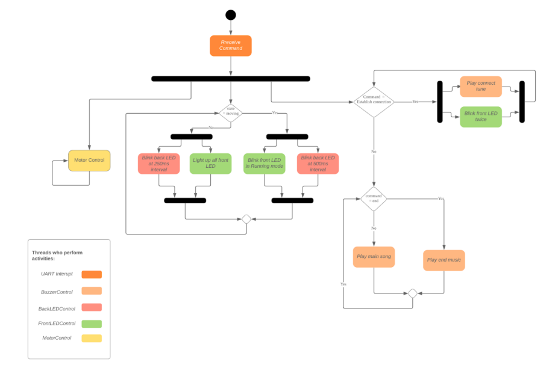

# RTOS-RC-Robot

## Project Description
The aim of the project is to design a RTOS-based robotic car that will be controlled through an Android App. The robotic car must be able to fulfil the following features:

1. Establish a BT connection with the Android App
2. Receive commands from the Android App and execute the correct response
3. Move the car in multiple directions.
4. Control the various LED’s according to the car’s status
5. Play different sounds/tunes according to the cars status.

## Project Demo

If you are unavailable to click the icon, you can view the video [here.](https://www.youtube.com/watch?v=lY2sMF7wDPk)

## RTOS Architecture

## Features
### BT connectivity
- Flash Green LED to indicate connection
- Receive specific data from BT06 then start LED and play tone
- Call play tune

### Motor Control
- Move in all 4 directions
- Have function for each direction
- Control all 8 pins for each direction
- TPM/PWM initialize all 8 pins using library functions
- Choose which pins belong to which wheel
- Create function to configure each wheel
- Create function to configure movement using function for wheels
- Create function to receive data from app and choose direction

### LED Control
- Green LEDs running mode when moving
- Green LED all lit when stationary
- RED LED flashing (1 Hz) when moving
- RED LED flashing (2 Hz) when stationary
- GPIO initialize all 11 pins using library functions
- Abstract GPIO initialization
- Create function to control GPIO pins
- Create function for running mode vs all lit mode
- Create function for 1 Hz and 2 Hz

### Audio Control
- Continuously play song from start to end
- Play unique tone at the end
- TPM/PWM initialize 1 pin using library functions
- Create function to play tune running vs tune end

## Overall Algorithm

##### For much clearer explanation, please look at the `Final Report.pdf` document. 

### Initialization
On startup, we initialize our PWM, LED and UART through initPWM(), initLED()and initUART2(), and then initialize 
the kernel, create the threads as stated in section 1.2., and start the kernel.
The first thread to run is MotorControl since it has the highest priority. As no data packet has been received yet, it does 
nothing and gives up the CPU for 1ms using osDelay(1). This causes the next highest priority thread, BuzzerControl, 
to run which starts to play the respective notes of the main song tune. The call of osDelay() between successive notes 
enables FrontLEDControl to run which turns on all the green LEDs since the global variable state is 0 as the bot is 
stationary. It then gives up CPU for 100ms and finally allows BackLEDControl to run which toggles the back red LEDs
and gives up the CPU for 250ms.

### Upon Establishment of a Bluetooth Connection:
On connect, the mobile app would send the data packet, 0x08, to the Bluetooth module. The ISR, UART2_IRQHandler, 
would hence get triggered and read the data packet into the global variable data.
When MotorControl runs, upon checking that the data packet received is 0x08, it would try to acquire the ledMutex
to ensure that the front LEDs blink by first turning the LEDs OFF. After which, it would sleep for 1s by calling osDelay(1).
Next, BuzzerControl runs and upon checking that the data received is 0x08, it would play the connect tone, giving up 
the CPU after each note for the duration of the note, and setting the frequency of the note by setting the PWM frequency. 
After the end of the connect tone, it would once again start to play the main tune.
Meanwhile, after 1s, when motor control is ready to run again, it would turn the LED on, give up the CPU again for 1s. This 
toggling cycle would repeat for another time before changing the global variable data to 0x09 and releasing ledMutex.
During this process, when the code reaches FrontLEDControl, it would try to switch the LEDs on. However, it would be 
unable to do so as it is unable to acquire ledMutex, and it would enter a blocked state. It would only run and turn the LEDs 
ON after ledMutex has been released. Meanwhile, BackLEDControl would continue to ensure that the red LEDs blink 
at the correct rate. 

### On Data Packet:
The app sends a data packet when a respective button corresponding to an action that needs to be done, is pressed. The 
table below shows the corresponding packet that is sent. As for direction commands, the app would send a single packet corresponding to the respective direction that we want the 
bot to move, when we press and continue to hold the respective button. Once the button is lifted up, the app would send a 
single stop packet. As such, the data 0x09 is not represented by any buttons and would be sent automatically whenever 
the buttons corresponding to the directions are released.
When the ‘Set Power’ button in the app is pressed, an integer value of 10 to 110 is sent, which corresponds to the 
speed at which we want the bot to move. This value is the nearest integer percentage of the speed slider bar + 10. The 
larger the integer value, the faster the bot would move. Likewise, an integer value between 205 - 230 would be sent if the 
curvature slider bar had been modified which corresponds to the angle at which we want the bot to curl. Similar to the speed 
cursor bar, a larger value represents a wider curvature angle and vice versa.
When UART2 interrupt is triggered, the data packet is read from the UART register and stored in the global variable data. 
It also sets the global variable state to 1 if the data packet corresponds to the bot moving (which is anything between 
0x02 and 0x07).
When MotorControl runs, it would take action based on the data, and if it corresponds to a direction command, it sets 
the PWM duty cycle of the motor respectively, multiplied by the power and curvature that we have set accordingly. If data 
is between 10 - 100, we know that it is a power packet, and we calculate and set the desired power variable in the task. 
When the task runs the next round 1ms later, the PWM duty rate would be then updated. Similarly, if data is above 200, 
we know that it is a curvature value, and set it accordingly, which would update the PWM duty rate in the next iteration. At 
the end of each loop, the CPU is given up for 1ms in order to let other threads to run.
Thus, this allows for the BuzzerControl to run when it needs to change the notes of the song accordingly. When
FrontLEDControl and BackLEDControl run, they would check the global variable state and flash the LEDs
accordingly.

### Upon Reaching the End of the Maze
Upon finishing the maze, the Stop button in the app (which is different from the data packet 0x09 that corresponds to ‘Stop 
Moving’) needs to be pressed to indicate that the bot has finished the maze. This would send a data packet of 0x01. When 
the data being read is 0x01, the BuzzerControl thread will set its local variable, end, to 1. Thus, on all subsequent runs 
then after, upon checking end = 1, BuzzerControl would play the ending song tune instead of the earlier music tune.
